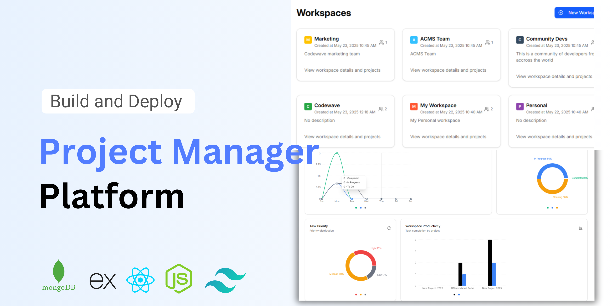

# Vazifa - Project Management Application



## Overview

This project is a modern, responsive Project Management Dashboard application built with React, Vite/React Router v7, TypeScript, and Tailwind CSS v4, utilizing Shadcn UI for pre-built components. It allows users to manage workspaces, projects, and tasks, with features for collaboration and tracking progress. The application works with a NodeJs backend with Express and a MongoDB database.

## Features

### Frontend Features:

- **Dashboard Overview:**
  - Quick summary of total projects, tasks (total, completed, in-progress, to-do).
  - Display of recent projects with progress bars.
  - List of upcoming tasks.
  - Statistical charts for task and project distributions (using Recharts).
- **Workspace Management:**
  - View all workspaces.
  - View details of a specific workspace, including its projects.
  - Create new workspaces.
  - Invite members to workspaces.
  - Transfer workspace to one member.
- **Project Management:**
  - List projects within a workspace.
  - View project details: description, status, progress, tasks, members.
  - Create new projects.
  - Update project status, progress, and details.
  - Archive/unarchive projects.
- **Task Management:**
  - List tasks for a project or all user tasks ("My Tasks").
  - View task details: description, status, priority, due date, assignee, comments, attachments.
  - Create new tasks.
  - Update task details, status, priority, and assignee.
  - Add comments to tasks.
  - Add attachments to tasks.
  - Add reactions to comments.
  - Archive/unarchive tasks.
- **User Profile Management:**
  - View and update personal information (name, avatar).
  - Change password.
- **Notifications:**
  - View a list of notifications (e.g., task assignments, comments, mentions).
  - Mark notifications as read.
  - Mark all notifications as read.
- **Members Page:**
  - View workspace members.
  - Search members by name, email, or role.
  - List and grid views for members.
- **Achieved Items Page:**
  - View archived projects and tasks.
- **Authentication:**
  - Sign in and Sign up pages.
  - Forgot Password, Email Verification and Password Reset Pages.
- **Responsive Design:** Adapts to various screen sizes.

### Backend Features (API):

The backend is a NodeJs and Express application `/backend`. This API is a real backend by managing data in MongoDB.

- Authentication and Authorization
- CRUD Operations (Create, Read, Update & Delete) - Workspace, Project & Tasks

- **Notifications:**
  - Email Notification with SendGrid.
  - Security with Arcjet

## Tech Stack

- **Frontend:**

  - **React:** JavaScript library for building user interfaces.
  - **TypeScript:** Superset of JavaScript that adds static typing.
  - **Vite:** Fast frontend build tool.
  - **React Router v7:** For client-side routing.
  - **Tailwind CSS:** Utility-first CSS framework for styling.
  - **Shadcn UI:** Re-usable components built with Radix UI and Tailwind CSS.
  - **Lucide React:** Icon library.
  - **Recharts:** Composable charting library.
  - **TanStack Query (React Query):** For data fetching, caching, and state synchronization.

## Setup and Installation

### Prerequisites

- Node.js v20 and above (LTS version recommended)
- npm (comes with Node.js) or yarn/pnpm
- MongoDB database (local or cloud, e.g., MongoDB Atlas)
- (Optional) SendGrid and Arcjet accounts for email and security features

---

### 1. Get the Source Code

You can either **clone the repository from GitHub** or **unzip a provided zip file** containing the code.

#### Option 1: Clone from GitHub

```sh
git clone https://github.com/LatifRjdev/vazifa.git
```

#### Option 2: Unzip the Zip File

- Download the zip file containing the project.
- Unzip it to your desired location.
- Open a terminal and navigate to the unzipped `Vazifa` directory:

```sh
cd path/to/Vazifa
```

---

### 2. Frontend Setup

```sh
cd frontend
npm install
# or: yarn install
# or: pnpm install
```

#### Create a `.env` file in the `frontend` directory:

```env
VITE_API_URL=http://localhost:5000/api-v1
VITE_CLOUDINARY_NAME= your cloudinary cloud name
VITE_CLOUDINARY_UPLOAD_PRESET= cloudinary upload preset
```

#### Start the frontend development server:

```sh
npm run dev
# or: yarn dev
# or: pnpm dev
```

The app will typically be available at http://localhost:5173.

---

### 3. Backend Setup

```sh
cd ../backend or cd backend
npm install
# or: yarn install
# or: pnpm install
```

#### Create a `.env` file in the `backend` directory with the following variables:

```env
PORT=5000
MONGODB_URI=your_mongodb_connection_string
JWT_SECRET=your_jwt_secret
FRONTEND_URL=http://localhost:5173
SENDGRID_API_KEY=your_sendgrid_api_key
SENDGRID_FROM_EMAIL=your verified email on sendgrid
ARCJET_KEY=your_arcjet_key
ARCJET_ENV=development  ## Only needed in development
```

> ⚠️ **Important:**
>
> - Replace the values above with your actual credentials and secrets.
> - You must obtain your own MongoDB URI (e.g., from MongoDB Atlas), SendGrid API key, and Arcjet key.
> - Never commit your `.env` files to version control.

#### Start the backend server:

```sh
npm run dev
# or: yarn dev
# or: pnpm dev
```

The backend will run on http://localhost:5000 by default.

---

### 4. Verify Environment Variables

- Ensure both `frontend/.env` and `backend/.env` are correctly set up with valid values.
- The frontend should point to the backend API URL, and the backend should have all required secrets and connection strings.

---

This README provides a comprehensive guide to the project. If you have any questions or need further assistance, feel free to ask!

Email: codewavewithasante@gmail.com
